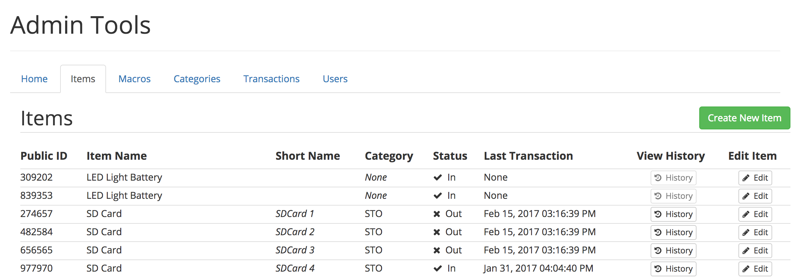
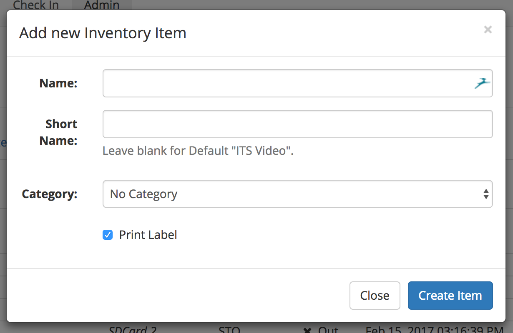
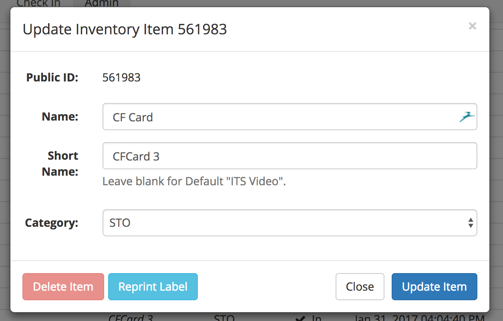
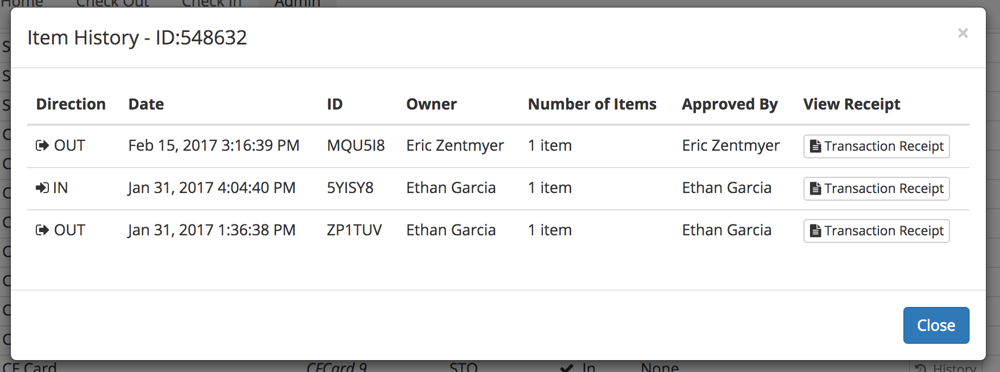

# Items

Items are the smallest unit in your inventory, and serve as building blocks through the system. Every item is assigned a unique 6-digit public identifier, which is printed on the barcode. While the code printed on the barcode may be 8 digits, only the middle 6 are used to determine the item's ID.

When you click on the "Items" sub-menu in the Admin view, all of the inventory items will be loaded in creation order. You can click on any column header, except for "View History" and "Edit Item" and the list will be sorted either in ascending or descending order based on that column. If you are looking for a specific item, you can use your browser's find tool to locate it.

## Create New Inventory Item

To create a new inventory item, click on the green "Create New Item" button at the top of the list view. A modal prompting you for the item details should appear.

The Name is used to refer to the item throughout the system, especially when creating new transactions \(checking out or in items\). There is essentially no limit on the length of this string, so be descriptive. The short name can be used to quickly identify an item that looks similar to another item, like an SD Card. These are limited to 9 characters in length, and if left blank, the default string will be printed instead.

## Edit an Item

To modify or reprint an item label, click on the "Edit" button that corresponds to the item you would like to edit. A modal with the item details should appear. Depending on the size of your inventory, it may take a moment to load.

From here you can change the item's name, short name or category. If you would like to create a [category](categories.md), you will need to go to that submenu first and create it. You may find that for some items, the delete button has been disabled, this is because once an item has been checked out at least once, it can no longer be deleted. While an item can always be updated, only items that have never been associated with a transaction can be deleted. This is done to ensure the integrity of the transaction database. When you are done, click the "Update Item" button to return to the list view.

While you can edit an item to become a completely different item, this is strongly discouraged as the item is used to generate past transaction reports and item history. Updates should always keep the spirit of an item to ensure that transaction history, past, present, and future, is maintained.

## View an Item's History

Once an item has at least one transaction associated with it, the "View History" button in the list view will be enabled, and clicking on that button will show a list of all transactions that that item has been associated with.

From here, you can see all of the transactions, the direction of the transaction \(in or out\), as well as who completed and approved the transaction. Each transaction generates a Transaction Receipt which list all of the items in that transaction, as well as some additional pertinent information.

